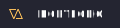

  
  <h3 align="center">
  Hola, soy Tomás Bohn Guixeras 👋
   
  Fullstack Web Developer
  </h3>

 

### 🚀 Sobre mí
Aprendo mientras construyo cosas útiles y comparto el proceso. Me interesan la automatización y llevar la tecnología a situaciones reales. Este espacio es mi bitácora: prototipos, notas y avances pequeños, sin humo — solo progreso constante.
> **Comparto** avances en X → [@tomasguixeras](https://x.com/tomasguixeras)

---

### 🛠️ Stack actual
> Cambio de herramientas cuando el problema lo requiere.
- **Frontend:** React · Next.js · TypeScript · Tailwind CSS · Material UI
- **Backend:** Node.js · NestJS · Express · PostgreSQL · MongoDB  
- **Otros:** Git · Figma · Photoshop · Illustrator  

---

### 🌐 Conecta conmigo

